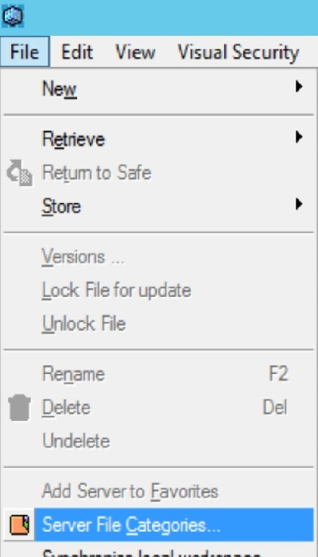
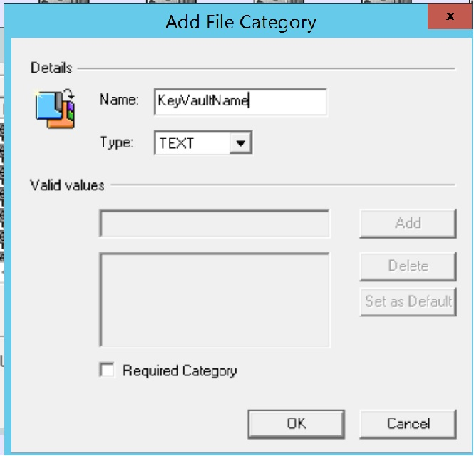
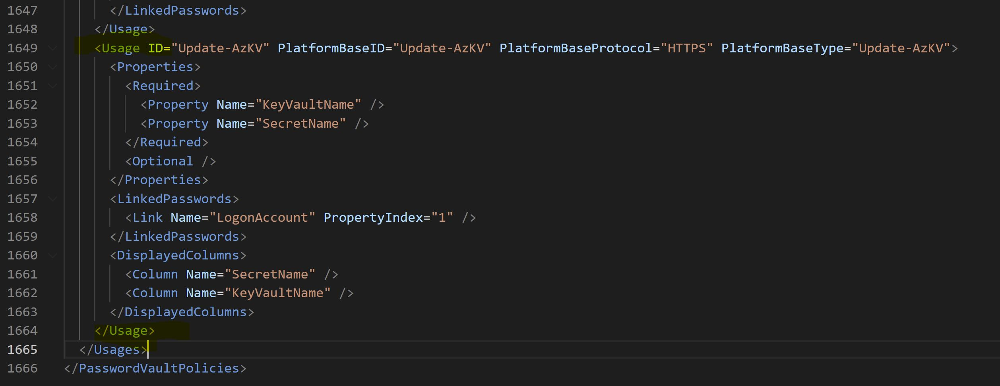
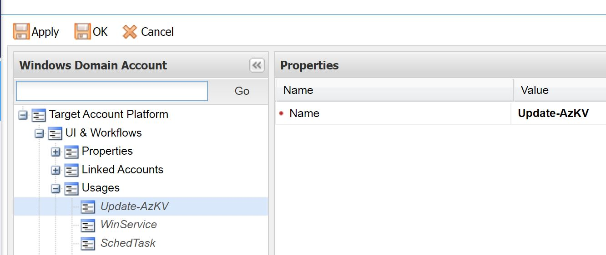

# Sync CyberArk Passswords in Azure KeyVault
This CyberArk CPM plugin can push or update or sync passwords from CyberArk Vault to Azure Key Vault.

[Prerequisites](#prerequisites)

[Configuration](#configuration)

[Add Azure Key Vault Usage](#add-azure-key-vault-usage)

#### Prerequisites
1. [Azure Az PowerShell Module] (https://docs.microsoft.com/en-us/powershell/azure/install-az-ps?view=azps-8.0.0)
2. PowerShell version v5.0+
3. CyberArk CPM - TPC
4. Download the package and place below files in the CPM bin folder
- UpdateAzKVProcess.ini
- UpdateAzKVPrompts.ini
- Update-AzKV.ps1
5. Azure AD or AD account with permission to update the secret in Azure Key Vault
6. Connection from CPM server to Azure (https://portal.azure.com)

## Configuration

#### Add KeyVaultName and SecretName File Category in Vault Server
1. Login to PrivateArk Client and click on File -> Server File Categories

2. Add 2 new TEXT type File Category by clicking on New button and name them as KeyVaultName and the next one as SecretName

#### Create New Service Account Platform
1. Using PrivateArk Client, Retrieve & Safe Policies.xml from PVWAConfig Safe. Edit the Policies.xml and add XML code from Add_Policies.xml (usage) to Policies.xml, inside the Usages tag.

_Note: Ensure you keep a backup of Policies.xml_

#### Add Service Account Platform or Usage to the Account platform
On the desired platform add the Usage Update-AzKV and ensure SearchForUsage is set to Yes.
1. To add the Usage. Login to PVWA as a Vault Admin, Navigate to Administration -> Platform Management -> Select the platform and Edit it. Expand UI & Workflows -> Right click on Usages and Add Update-AzKV

2. To check SearchForUsages, Edit Platform -> Automatic Password Management -> General

## Add Azure Key Vault Usage
Once you have enabled the Update-AzKV Usage at platform level.
1. Open the Account (in classic interface) whose password you want to push to Azure Key Vault
2. Click on Update-AzKV

3. Add a usage with the details Key Vault Name & Secret Name

4. Associated the logon (Azure AD or AD) account which has permission to update the secret in the Azure Key Vault

5. Click on the Change button in the usage to test the push / update operation.

If SearchForUsage is set to Yes, on the next CPM performed password change, the password will be automatically updated in the Azure Key Vault.
 
